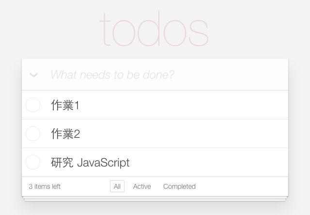

# 作業

## hw1：實作基本網格系統

其實網格系統說穿了，就只是在不同寬度的時候依照比例調整 column 的寬度而已。這一個作業，你要實作出基本的網格系統，詳細規格可參考下面：

1. 每一個 row 有 12 格
2. 有一個叫做 container 的 class 會把裡面的內容置中，最大寬度則是 960px
3. 一共有 12 種 col 的 class，col-1, col-2...col-12

只要螢幕寬度小於 720px，每一格都會佔滿整個 row。

可參考範例：（待補）

## hw2：超基礎 Todo list

請你完成一個很簡單的 Todo List，需要有以下功能：

1. 身為使用者，我可以新增 todo item
2. 身為使用者，我可以刪除 todo item
3. 身為使用者，我可以標記某個 todo item 已完成

可參考範例：（待補）

## hw3：加強留言板

之前在課程中講過 Bootstrap 這一個好用的 library，能夠讓你把版面變得好看一點，現在就請你利用 Bootstrap 改造之前的留言板。

另外，我們也提到了 Ajax，利用這項技術，我們可以不用換頁就發送 Request 並且收到回覆。請你把發送留言跟刪除留言的地方也改成 ajax，增進使用者體驗。

可參考範例：（待補）

## hw4：簡答題

1. 要如何存取跨網域的 API？
2. JSON 是什麼？
3. JSONP 是什麼？
4. HTTP method 有哪幾個？有什麼不一樣？

